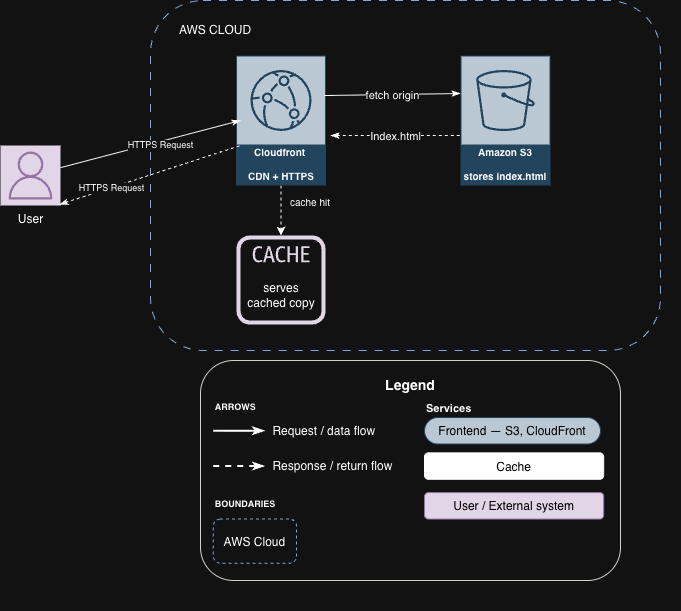

# AWS Static Portfolio Website

Static portfolio website hosted on AWS — S3 for storage, CloudFront for global CDN + HTTPS.
Part of my AWS CLF-C02 certification project series.

## Live URL
https://d3amgcp91yumuw.cloudfront.net/

## Architecture
User Browser --> CloudFront (CDN + HTTPS) --> S3 Bucket (origin)

## AWS Services
| Service | Purpose |
|---|---|
| Amazon S3 | Object storage + static hosting |
| Amazon CloudFront | Global CDN, HTTPS, caching |

## Cost: $0 (AWS Free Tier)

## What I Learned
Deployed a static website on AWS using S3 and CloudFront. Seeing CloudFront 
pull from S3 as the origin and serve the app globally over HTTPS in real time 
made the CDN concept click. Configured bucket policies, static website hosting, 
and CloudFront distributions from the AWS Console and Mac terminal.
